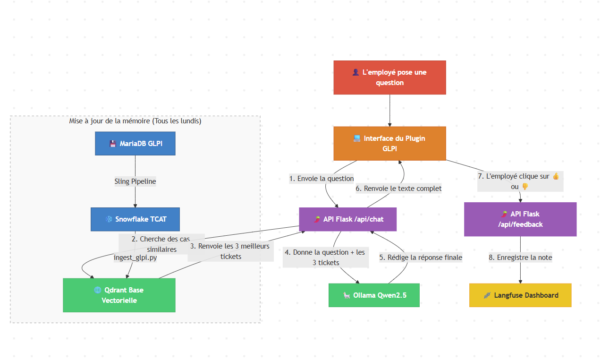
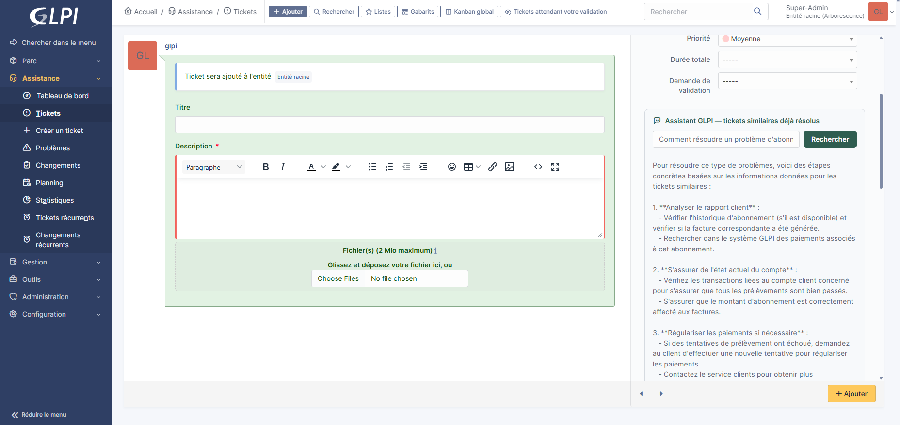

# Chatbot RAG pour tickets GLPI


Assistant qui aide les techniciens support à résoudre un ticket GLPI en s'appuyant sur
l'historique des tickets similaires déjà résolus — retrieval hybride, reranking par
cross-encoder, génération par un LLM local, et suivi qualité via feedback utilisateur.

Projet développé dans un contexte d'entreprise réel (nom anonymisé dans ce dépôt),
sur un historique GLPI de plusieurs dizaines de milliers de tickets.

## Architecture



- **Source** : base MariaDB de GLPI, répliquée dans Snowflake via Sling.
- **Ingestion** (`ingest_glpi.py`) : nettoyage (HTML, mojibake, anonymisation RGPD),
  chunking par ticket (`probleme` / `solution`), double embedding (dense + sparse BM25),
  upsert dans Qdrant.
- **Retrieval** (`app/rag.py`) : recherche hybride dense + BM25 fusionnée par RRF,
  déduplication par ticket, reranking par cross-encoder, génération de la réponse par
  un modèle Ollama local.
- **API** (`app/main.py`) : endpoint FastAPI consommé par un plugin GLPI natif
  (`glpi-plugin/`) qui affiche l'assistant directement sur le formulaire de création
  de ticket.

  
- **Observabilité** (`app/tracing.py`) : traces Langfuse (auto-hébergé) sur chaque
  requête, avec notation de la réponse par l'utilisateur final — la boucle de feedback
  sert à identifier concrètement où le LLM se trompe, plutôt que de se fier à des
  métriques offline seules.

## Ce que ce projet illustre

- **Un vrai problème d'ingénierie de données** : un bug de mojibake (UTF-8 mal
  réinterprété en Latin-1) introduit par une connexion Sling mal configurée entre
  MariaDB et Snowflake, diagnostiqué et corrigé (voir `etat_des_lieux.md` et
  `ingest_glpi.py::fix_mojibake`).
- **RAG hybride, pas juste similarité vectorielle** : combinaison dense + BM25 (RRF),
  puis reranking par cross-encoder — voir `demo_reranking.md` pour un exemple concret
  où le retrieval seul se trompe et le reranking corrige.
- **Anonymisation à l'ingestion** : emails, mots de passe, références de tickets et
  signatures de techniciens sont systématiquement masqués avant indexation
  (regex dédiées dans `ingest_glpi.py`).
- **Honnêteté sur les limites** : `LIMITATIONS_CONNUES.md` documente ce qui ne
  fonctionne pas encore parfaitement (ex: noms de clients mentionnés en texte libre,
  non couverts par l'anonymisation regex) et les pistes déjà explorées/écartées.
- **Boucle de feedback réelle** : la notation utilisateur dans Langfuse permet de
  distinguer un problème de retrieval d'un problème de génération sur du vrai trafic,
  pas seulement sur un jeu de test synthétique.

## Stack technique

| Composant | Choix |
|---|---|
| Base vectorielle | Qdrant (dense + sparse BM25, named vectors) |
| Embedding dense | `all-MiniLM-L6-v2` |
| Embedding sparse | `Qdrant/bm25` (fastembed) |
| Reranking | `cross-encoder/ms-marco-MiniLM-L-6-v2` |
| LLM | Ollama, local (`qwen2.5:3b`) |
| Observabilité | Langfuse (self-hosted, Docker) |
| API | FastAPI |
| Source de données | Snowflake (répliqué depuis MariaDB/GLPI via Sling) |
| Intégration | Plugin GLPI natif (PHP + JS) |

## Démarrage

```bash
pip install -r requirements.txt
cp .env.example .env   # renseigner les identifiants Snowflake, Qdrant, Ollama, Langfuse
docker compose -f docker-compose.langfuse.yml up -d
python ingest_glpi.py
uvicorn app.main:app --reload
```

Voir `.env.example` pour la liste complète des variables nécessaires, et
`docker-compose.glpi.yml` pour lancer une instance GLPI locale de test avec le plugin.

## Structure du dépôt

```
app/                    Logique RAG (retrieval, reranking, génération, tracing)
glpi-plugin/glpirag/    Plugin GLPI natif (widget sur le formulaire de ticket)
sql/                    UDF Snowflake pour déporter le nettoyage dans l'ELT
ingest_glpi.py          Pipeline Snowflake -> Qdrant
etat_des_lieux.md       Journal technique (diagnostic mojibake, décisions Snowflake)
demo_reranking.md       Exemple concret de reranking (avant/après)
LIMITATIONS_CONNUES.md  Limites connues et pistes non retenues
```
